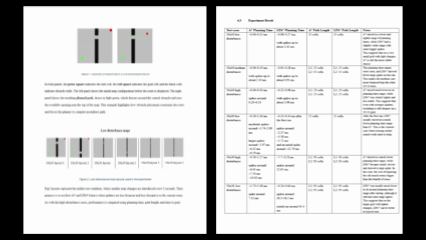

# Replanning in Robot Navigation: A* vs LPA*

## Overview
This project explores a core AI question in robotics: **how should a robot adapt its path when the environment changes while it is moving?**  

At first, robot navigation can seem like a simple shortest-path problem. But once obstacles appear, passages become blocked, or the map updates during motion, navigation becomes a **replanning** problem. A robot must decide not only where to go, but also whether it should **restart planning from scratch** or **reuse previous search work** to adapt faster. That became the focus of this project. 

## Purpose
Rather than trying to prove that one algorithm is always better, this project was designed around a more practical goal: creating a **replanning threshold**.  

The idea behind the threshold is simple:
- when map changes are **small or infrequent**, restarting with **A\*** may be enough
- when changes happen **more often**, **LPA\*** becomes more worthwhile because it repairs previous search effort instead of recomputing everything

This project was our way of contributing to the field in a focused and practical way: not by solving all of robot navigation, but by building a clear guideline for choosing between two important replanning strategies. 

## What We Did
We compared two approaches to dynamic navigation:
- **A\*** as the restart-planning baseline
- **LPA\*** as the repair-planning method

We tested them in dynamic grid-based navigation scenarios and observed how they behaved as the map changed during execution. Our comparison focused on planning behavior, replanning efficiency, and how each method responded to repeated updates.

## Key Finding
Our results supported the main threshold idea:
- **A\*** is a strong and simple choice when changes are limited
- **LPA\*** becomes more valuable when replanning happens repeatedly, because it reuses previous search information instead of starting over every time

This matches the central advantage of incremental replanning methods described in the literature. :contentReference

## Why This Matters
This project helped us see robot navigation as more than pathfinding. In AI, navigation is also about **decision-making under change**. A modern example is a warehouse robot: if one aisle is suddenly blocked, the robot must quickly decide whether to rebuild its entire path or efficiently repair the one it already has.

## Conclusion
The main takeaway from this project is that **replanning itself should be treated as a decision**. Sometimes restarting is sufficient, and sometimes repairing is the smarter strategy. Our threshold model captures that idea in a simple and practical way, which was the main purpose of this project from the beginning.

## Future Plans
The next step for this project is to test the replanning system in a more realistic robot simulation environment such as **Gazebo**. This would allow the project to move beyond grid-based experiments and closer to how path planning is used in real robotics. It is also something I want to explore further personally, since learning more about robot simulation and practical robotics systems is one of the main directions I would like to build on from this project !

Click to view full report

## ----- Repository Files -----

The repository is organized so that the **core planning code** is kept separate from the **experiment grid configurations**.

The main planner implementation is inside `workspace\experiment`, where the A*, LPA*, planner factory, ROS node, and default grid publishers are stored. These files contain the reusable navigation logic used across all experiments.

To make testing easier, the grid environments are separated into folders by map size:

- `grid_publisher_10x10`
- `grid_publisher_30x30`
- `grid_publisher_50x50`

Each of these folders contains different grid publisher files for that specific environment size, with versions for **low**, **medium**, and **high** disturbance or obstacle density. This setup made it easy to keep the planning code unchanged while running different experiments. For each test, I only needed to replace or run the relevant grid publisher so that the planners would receive a different map

### Core planner files
- `workspace\experiment\__init__.py`: Marks the folder as a Python package
- `workspace\experiment\astar.py`: Implements the A* search algorithm used as the restart-planning baseline
- `workspace\experiment\lpastar.py`: Implements the LPA* algorithm used for incremental replanning
- `workspace\experiment\planner_factory.py`: Creates the selected planner instance so the system can switch between A* and LPA*
- `workspace\experiment\planner_node.py`: Main ROS node that runs the planner and publishes the computed path
- `workspace\experiment\grid_publisher.py`: Publishes the default grid used for experiments
- `workspace\experiment\grid_publisher_30.py`: Publishes a 30x30 grid for medium-scale experiments
- `workspace\experiment\grid_publisher_50.py`: Publishes a 50x50 grid for larger-scale experiments
- `workspace\experiment\test.md`: Contains notes or supporting test information for the experiment setup

### Experiment grid folders
- `grid_publisher_10x10`: Contains 10x10 grid publishers for low, medium, and high disturbance cases
- `grid_publisher_30x30`: Contains 30x30 grid publishers for low, medium, and high disturbance cases
- `grid_publisher_50x50`: Contains 50x50 grid publishers for different disturbance cases

## ----- Core Planner Implementations -----

### `astar.py`
This file contains our A* implementation, which we used as the baseline planner in the project. We made it so that every time the robot needs a path, it solves the problem from scratch using the current grid, start, and goal. This was useful because A* is a standard and well-known pathfinding algorithm, so it gave us a clear reference point for comparison. In our experiment, this file represents the “restart planning” idea, where the robot does not try to reuse previous search work and instead computes a brand new path each time the map changes.

### `lpastar.py`
This file contains our LPA* implementation, which we used to explore incremental replanning in robot navigation. We made it to preserve useful search information from earlier planning steps instead of discarding everything after each map update. The main idea was that if only part of the environment changes, the robot should not always have to solve the whole pathfinding problem again from the beginning. In this file, we built LPA* to update and repair the old search based on what changed in the grid. This was one of the most interesting parts of the project because it connects directly to how robot navigation in AI can become smarter and more efficient in dynamic environments.